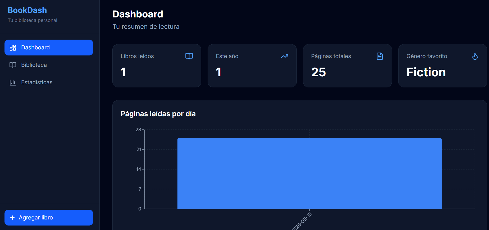
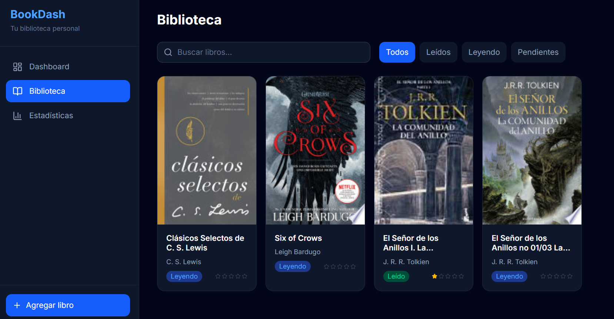
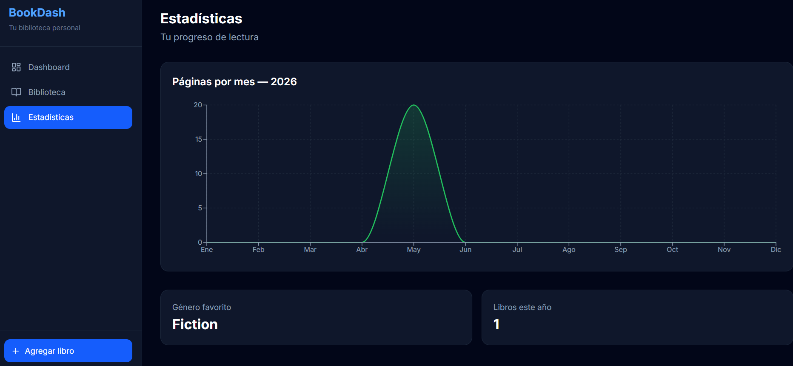

# 📚 LibrDash

Dashboard personal para gestionar tu biblioteca y hábitos de lectura.

## Screenshots




---

## Features

- Agrega libros desde Google Books API
- Dashboard con estadísticas de lectura
- Registro de sesiones de lectura por fecha
- Rating, notas y seguimiento de progreso por libro
- Autenticación con Supabase (registro e inicio de sesión)
- Cada usuario solo ve sus propios datos (Row Level Security)

---

## 🛠 Tech Stack

| Capa | Tecnología |
|------|-----------|
| Frontend | React 18 + TypeScript |
| Estilos | Tailwind CSS |
| Gráficos | Recharts |
| Backend / DB | Supabase (PostgreSQL) |
| Auth | Supabase Auth |
| Build | Vite |

---

## Instalación

```bash
# 1. Clona el repositorio
git clone https://github.com/Nubedev23/librdash.git
cd librdash

# 2. Instala dependencias
npm install

# 3. Configura las variables de entorno
cp .env.example .env
# Edita .env con tus credenciales de Supabase

# 4. Inicia el servidor de desarrollo
npm run dev
```

---

## Variables de entorno

Crea un archivo `.env` en la raíz del proyecto:

```env
VITE_SUPABASE_URL=https://tu-proyecto.supabase.co
VITE_SUPABASE_ANON_KEY=tu-anon-key
```

Encuéntralas en tu proyecto de Supabase → **Settings → API**.

---

## Base de datos

El proyecto usa dos tablas principales en Supabase:

**`books`** — Biblioteca del usuario
```
id, user_id, title, author, cover_url, total_pages, pages_read,
genre, rating, status, start_date, finish_date, notes, created_at
```

**`reading_sessions`** — Historial de sesiones de lectura
```
id, book_id, user_id, date, pages_read, notes, created_at
```

Ambas tablas tienen **Row Level Security** activado — cada usuario solo accede a sus propios datos.

---

## 📁 Estructura del proyecto

```
src/
├── components/
│   ├── charts/       # Gráficos (YearlyChart, PagesChart)
│   ├── layout/       # Sidebar, navegación
│   └── ui/           # Componentes reutilizables
├── context/          # BooksContext (estado global)
├── hooks/            # useBooks, useSessions, useStats, useSearch
├── lib/              # Cliente Supabase, helpers de API
├── pages/            # Dashboard, Library, Stats, BookDetail
└── types.ts          # Tipos TypeScript globales
```

---

## Scripts

```bash
npm run dev      # Servidor de desarrollo
npm run build    # Build de producción
npm run preview  # Vista previa del build
```

---
## Autor

Hecho por **MBQ** — [@Nubedev23](https://github.com/Nubedev23)
